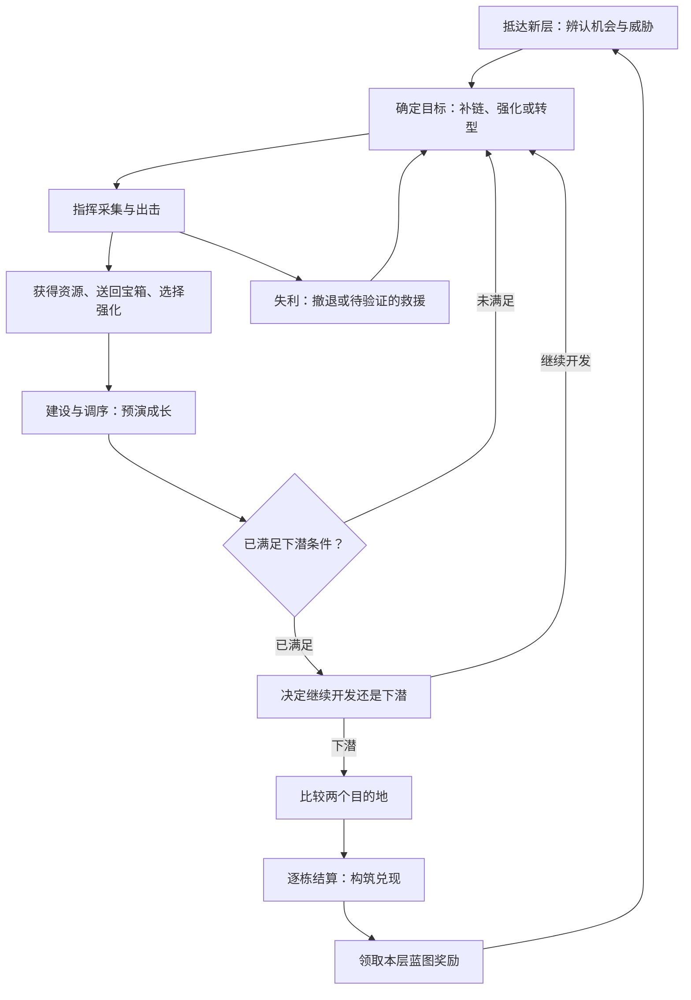

# 《深处的文明》GDD V3：被动城市经营 × 资源产业链 × 小队战术构筑

> 当前策划基线，由根目录 DeepCivilization_Roguelite_CitySystem_V2.md 整合修订。
> 本文描述目标设计，不代表全部功能已实现；旧版 deprecated GDD 仅供历史参考。
> 本轮确认：建筑全部 Passive、经济 Build 优先、主动营地战斗、过层循环、文明局外解锁。
> 数值草案与待验证方案不等同于已锁定规则。
> 2026-10-07 更新：第2章为核心体验与系统优先级入口；确认逐建筑结算面板（内部12槽位行，资源／部队／特效三列），三心救援及脱战恢复仍为验证方案。
> 2026-09-30 更新：原型先做宝箱自动搬运与中断掉落；普通资源即时入账；四个城门共享城市总血量。固定城市地块、运行预演与界面流程见第43～46章；Boss、生态、文明作为长期挂载系统，本轮原型不实现（第47章）。
> 本轮补充：双目的地预告与选择、建筑双维度标签、两个初始队伍位及兵种建筑组队。目的地选择提高资源可达性，帮助玩家提前规划产业链与战力兑现时机。

# 1. 产品定位与单局关注点

第一核心是资源循环模拟经营：随机蓝图决定经济方向，有限空间、生产吞吐、交叉配方与资源出口共同形成城市 Build。
第二核心是战斗 Build 与战术策略：玩家选择兵种、培养小队，并主动调度队伍清除营地，为建设争夺关键原料。

> 城市就是本局最大的 Build；Squad 是它下面的第二层 Build。
> 城市被动运转，小队主动调度。轻量指操作负担低，不是资源种类少。

单局关注点依次演进，并会在进入新时代后再次出现：

| 阶段 | 核心决策 |
|---|---|
| 战力评估与资源获取 | 打得过哪些营地？缺什么资源？投入几支队伍？ |
| 蓝图与 Build 方向确立 | 根据抽到的蓝图和地图资源，确定经济路线与关键 Sink |
| 资源链路搭建与 Build 成型 | 补齐生产、加工、消耗环节，配平吞吐，把经济兑现为战力 |
| Build 完善与时代推进、全面补强 | 扩充产能、补军事及环境短板，权衡升级时机 |

成长应同时呈现产业网络变复杂、城市功能分化、军队扩大、并行开发能力提高，以及从承受环境到利用环境。

---

# 2. 核心体验循环与下潜

> 核心体验：玩家判断这层值得拿什么，用战斗获得材料与构筑机会，调整城市让资源按自己的计划转化为战力，再选择下一次值得承担的风险。

**到达新区域 → 确定成长目标 → 采集与出击 → 获得材料和构筑机会 → 建设与调序 → 达标后决定去留 → 选择目的地 → 逐栋结算 → 领取本层蓝图 → 进入下一层。**

采集、战斗和建设可以交错进行；以下描述玩家体验，不是强制逐项完成的任务列表。所有新增系统应明确服务于哪个环节，不能解释其作用的内容降低优先级。本章为核心体验入口；详细约束见第41～46章。



## 2.1 抵达新层：看见机会，形成计划

**目标体验：**“我知道自己缺什么，也能看出这层有哪些机会，但要决定先拿哪个。”

- 保留城市、建筑、永久强化和小队编制；换层恢复部队人数与生命，刷新外部资源和敌人。区分永久编制、当前存活人数与当前生命。
- 镜头首先呈现城市和附近安全资源，玩家可继续查看各营地。HUD显示城市共享生命与本层击杀进度；救援方案启用时才显示剩余次数。
- 当前产业链涉及的资源固定显示。短缺资源即使库存为0也不隐藏；无关资源可以折叠。
- 资源点显示种类与可采集数量；营地显示主要敌人类型、模糊威胁和主要奖励，不以精确必胜率替代玩家判断。
- 目的地预告承诺的资源必须存在实际获取路径。缺料建筑可以查看缺口及其影响的成长效果。

**核心决策：**先采集安全材料、挑战营地，还是根据这层机会转型？
**服务系统：**目的地信息兑现、资源短缺提示、营地威胁差异、跨层资产继承。

## 2.2 确定成长目标：将“变强”转成具体需求

**目标体验：**“拿到这些材料，就能让这个建筑运行，再让这支队伍变强。”

选中建筑后，详情显示执行需求、效果、预计能否运行、缺口与原因，并说明采集、增产、调序或禁用其他消费者等可用调整手段。例如兵营需要20食物，前序厨房消耗后预计缺8食物，应说明竞争关系，而不只提示“资源不足”。数字为界面示例，不是数值配置。

玩家可钉住短缺资源，持续查看库存与下一次结算的预计净变化；可以追溯主要生产和消耗建筑。界面解释因果，不自动给出唯一最优路线。

**核心决策：**本层优先扩军、输出还是生存？有限资源优先供给哪个Sink？
**服务系统：**完整经济预演、资源竞争解释、全局标签强化说明。

## 2.3 采集与出击：判断风险并承担代价

**目标体验：**“这场战斗值得打；如果判断失误，我知道自己付出了什么。”

- 小队支持点选、框选与命令队列。普通资源即时入账，用资源图标与数字反馈数量，不引入普通资源往返物流。
- 同层营地具备可辨认的强弱与奖励差异。高风险目标更有吸引力，但不能让所有正常成长都依赖最强营地。
- 战斗清晰显示人数、生命与主要技能。永久编制和存活人数分别表达。
- 快进缩短移动与无悬念战斗；关键构筑选择暂停，关闭后恢复此前暂停状态与速度。快进不改变模拟规则和收益。
- 击杀达标只解锁下潜，不要求清空地图。

**核心决策：**投入几队、选择哪个敌人、何时撤退？
**服务系统：**威胁可读性、基本兵种互补、撤退、死亡清理、操作队列与快进。

### 容错分支：三心救援（验证方案，尚非正式锁定规则）

测试目标是让错误选敌付出有限代价后仍能重新决策，不鼓励原地反复送兵磨怪。

- 正常撤退不自动扣心；手动请求救援或全军覆灭的自动救援拟消耗1心，将已有编制与生命恢复到城门附近。
- 救援不增加永久编制、不恢复城市共享生命；携带宝箱按中断规则落地。手动与自动共用一次流程，防止连续扣心。
- 候选方案为开局3心、上限3心；未来入侵通关恢复1心且只结算一次。不为验证救援而提前制作入侵系统。
- 脱战营地恢复战斗状态作为对照测试候选，具体恢复范围和时点未定；无论是否恢复，都必须避免重复刷击杀进度、资源和宝箱，已解锁箱子不重新锁回。
- 心耗尽后的全灭处理、敌方残余生命是否保留及恢复规则，需完成测试后确认；不擅自增加另一条正式失败条件。
- 持续免费补兵暂缓，不与三心同时上线，以免等待替代经济构筑和风险判断。

## 2.4 战利品：将胜利转成构筑选择

**目标体验：**“这次胜利给了我改变本局的机会。”

普通材料直接入库存；重要宝箱采用实体运输：清守卫解锁 → 队伍下一行动插入取箱回城 → 成员举箱 → 可达城门交付 → 奖励。保留原有后续指令。转战、取消运输、搬运成员死亡等使宝箱落地，可再次取回；同一宝箱只能交付和领奖一次，详见第44章。

奖励浮层居中、背景城市仍可见，暂停运行。三张卡片写清效果、对象与触发条件；可标出与已有兵种或建筑的匹配，不代替玩家指定最佳选项。多个奖励排队展示。

**核心决策：**补短板、强化优势，还是为转型准备？
**服务系统：**宝箱队列、唯一交付、奖励三选一、作用标签。

## 2.5 建设与调序：调整能看懂的经济机器

**目标体验：**“改变布局和资源分配后，这条链真的跑起来了。”

- 中央钻机4×4，周围12个2×2建筑位；点击空位加号打开紧凑蓝图列表，显示费用和不可建原因。建筑被动运行，无需逐层点击。
- 建造、选中或重摆时显示执行序号：从上到下、每行从左到右。合法槽位可免费重摆，不刷新历史收益。
- 库存、布局、启用状态或队伍条件变化后，刷新整轮预演。预演可执行者播放工作循环；缺料、禁用、满编或无适用目标分别说明。
- 显示“本次结算后”预计库存与军事成长。过层增员和强化在下潜结算时兑现，不把预期收益提前用于本层战斗。
- 首次落成生成小队、在场光环与过层永久成长是不同触发，按各自明示规则处理，不能把所有建筑效果统一误延后到过层。
- 临时资源可以补缺失的加工或生产环节，让战力先成长；长期仍需永久蓝图和产能，不能把整套产业长期免费外包给临时补给。

**核心决策：**槽位用于生产还是强化？谁先消耗资源？临时补链还是建立长期产能？
**服务系统：**固定槽位、空间优先级、统一预演、受控资源供给、全局modifier。

## 2.6 达标后的去留：带成果离开，或继续冒险

**目标体验：**“我已经能走，但留下仍有收益，这是我的选择。”

击杀达标后，钻机切为准备下钻AB动画，HUD显示可下潜，不强制弹窗或中止行动。玩家可继续采集、回收宝箱、挑战营地，也可点击基地选择目的地。确认下潜时提示未交付战利品，允许返回回收或明确放弃。

普通层首版不额外增加倒计时压力。测试是否形成“每层必须清空”的惯性，再决定额外开发的机会成本，不以复杂灾害系统提前解决尚未验证的问题。

**核心决策：**额外收益是否值得战损、救援消耗与操作时间？
**服务系统：**下潜状态、战利品提示、可选高风险目标。

## 2.7 选择目的地：同时选择材料、机会与考验

**目标体验：**“我不能保证抽到一切，但能主动提高路线成型的机会。”

左右两张目的地卡展示部分明确资源、模糊威胁与主要特征、蓝图奖励倾向；标出与已钉住缺料资源的匹配。旁边允许查看本次结算后预计队伍状态，帮助判断下一层实力。

目的地奖励倾向属于目标层完成后的蓝图，不提前发放；当前层奖励使用当前层自己的池。确认前可返回调城，确认后锁定布局和其他资源操作，再执行一次结算。候选预览不触发生产。

**核心决策：**材料、蓝图机会与风险如何取舍？
**服务系统：**双目的地、受控随机、可达性、结算后战力预测。

## 2.8 下潜结算：十二建筑行 × 资源／部队／特效三列

**目标体验：**“我能沿着每一行，看见资源最终变成了哪一种战力。”

确认下潜后，屏幕右侧约1/3展示结算面板（scoreboard），左侧保留城市。面板主体按建筑逐行展示，基础12行对应12个内部槽位；左侧另设建筑图标、名称和执行序号标识区，效果区为**资源、部队、特效**三列。

| 建筑／执行顺序（标识区） | 资源 | 部队 | 特效 |
|---|---|---|---|
| ① 伐木场 | 木头＋20 | — | — |
| ② 加工坊 | 木头−10 → 木板＋5 | — | — |
| ③ 剑士兵营 | 食物−20 | 剑士永久编制＋1 | — |
| ④ 铁匠铺 | 木头−10、黄金−5 | 近战攻击＋1 | — |
| ⑤ 附魔设施 | 知识−10 | — | 剑士获得火焰攻击 |
| ⑥ 厨房〔缺料〕 | 需求20食物／当时可用5；实际扣除0 | 本轮未强化 | — |

表格是展示语义示例，不新增已解锁建筑、不替代正式数值表。

- 行顺序与真实空间执行顺序一致，城市建筑与对应行同步高亮；完成当前行再处理下一栋。空槽淡化占位，不分配执行序号、不播放结算。
- 资源列记录实际收支；部队列记录人数与数值成长并标明作用范围；特效列记录新增或改变的规则。同一效果不重复计入两列。
- 缺料完全跳过、不扣部分费用；行变暗，显示缺口，悬浮可看原定效果。禁用、满编、无目标等分别标明，不冒充成功或缺料。
- 每栋至多执行一次，前方实际产出可供后方使用；后方补料不能追溯补做前方跳过的建筑。正式逻辑见第45.3章。
- 外侧塔位不属于内部12槽。若有过层消耗或成长，必须增加对应行并按真实坐标插入同一序列，不能为了保持12行漏记或改变执行顺序。额外行可滚动查看，当前执行行保持可见。
- 底部保留最终资源库存汇总与本轮军事成长摘要；允许查看缺料等关键未执行原因。
- 结算前库存已包含本层采集、建造消费与其他实时变化，不能再次加一遍野生资源。结算后库存＝结算前库存＋各行实际产出−各行实际消耗。
- 不默认采用整轮统一的“a＋b×c−d×e”：不同建筑的倍率和先后条件可能不同。每行详情可展示基础值×该次实际倍率；只有确实统一的倍率才可合并展示，汇总面板不进行第二次生产。
- 允许加速或跳过表现，结果保持一致。模拟流程驱动表现和提交，不能只靠动画回调发资源。

**核心决策的反馈：**展示玩家此前建设、补链和调序的结果，帮助判断下层要修复或加强什么。
**服务系统：**逐建筑账本、统一预演和真实结算、原子提交、唯一结算、成长摘要。

## 2.9 领取蓝图：形成下一轮值得追求的目标

**目标体验：**“城市已经变强，同时出现了下一步可能性。”

结算完成后展示当前层的永久蓝图三选一，说明造价、资源关系、适用对象和当前主要材料条件。受控随机提供补链、补短板或转型机会，但不保证指定套路每局成立。选择后获得本局建造权限，不补做刚结束的结算；进入此前选定的新层后再建设。

**核心决策：**让当前路线稳定，还是投资潜力更高的新方向？
**服务系统：**阶段池、蓝图标签、清晰奖励时点、跨层继承。

## 2.10 本局结束：认出自己的构筑

**目标体验：**“这局是我搭出来的；我知道它强在哪里，也知道它卡在哪里。”

四门共享城市总血量归0时结束本局，不采用单门独立破坏判负。结算画面保留城市全景，展示深度、挑战难度、最终布局、队伍和关键强化、主要经济与军事成果、直接失败威胁，并支持保存构筑截图。

不设置固定层数上限；阶段Boss不是固定终点。文明解锁属于长期局外循环，不以新增内容奖励替代原型本身的可重玩性。其他结束条件和救援耗尽后的边界待验证，不在本轮默认为已确认。

## 2.11 按核心体验决定开发优先级

| 本轮优先落实 | 先验证再决定 | 暂缓或长期挂载 |
|---|---|---|
| 资源短缺可见、统一预演、逐建筑结算账本 | 三心救援与脱战恢复边界 | 持续免费补兵 |
| 12槽位、空间顺序资源分配 | 达标后继续开发的收益与风险 | 自由形状城市与扩地 |
| 威胁不同的营地、临时资源补链 | 少量兵种联动与地块附魔 | 个体士兵随机属性 |
| 宝箱搬运、明确奖励和换层时点 | 快进是否掩盖重复操作 | 普通资源物流、复杂生态 |
| 双目的地、受控随机 | 三套早期构筑能否及时成型 | 全时代资源池、完整Boss和文明系统、WFC建筑联动 |

首轮验证记录：玩家能否解释缺料和执行顺序；能否通过采集、调序或路线改变恢复成长；有多少层战力停滞；临时材料能支撑几次兑现；失败是判断失误、链路不可达、吞吐不足还是成型过晚。测试策略全部失败不等于证明种子无解，应结合人工复盘。

普通层仍以主动争夺资源为主；入侵与灾害是后续特殊压力，不转为逐波等待的传统塔防。击杀要求是否精英加权仍待验证。

---

# 3. 建筑角色体系

## 3.1 Source / Transform —— 经济来源与资源转化

Source 生产资源；Transform 消耗输入生成其他资源；Sink 消耗资源兑现军事、科技等能力。三者是经济角色标签。
Squad / Defense / Research / Special 是另一维度的功能用途标签，可与经济角色组合，不建立六种互斥建筑类别。详见第12章。
本节中的 Defense 描述功能用途。

Source 与 Transform 共同承担的任务是：

```text
增加资源获取
+
提升资源转化效率
+
把低阶资源升级成高阶资源
```

典型例子：

```text
Lumber Camp
→ 每过一层获得 Wood

Quarry
→ 每过一层获得 Stone

Refinery
→ Wood + Stone
→ Processed Material

Foundry
→ Ore + Fuel
→ Steel

Arcane Converter
→ Gold + Knowledge
→ Arcane Component
```

Source 不直接成为最终 Win Condition。

Source 的价值在于：

> 提高整个文明的经济吞吐量。

---

## 3.2 Sink —— 把经济转成实力

Sink 是整套系统里最重要的“价值落点”。

它负责：

```text
消耗资源
→ 获得永久成长
或
→ 获得当前 Floor / 若干层的强力效果
```

典型例子：

```text
Barracks
每过一层：
消耗 Food
→ 当前 Squad 永久 +1 Warrior
```

```text
Blacksmith
建造时 / 每层：
消耗基础资源
→ 全军永久 +1 Attack
```

```text
Military Academy
消耗高级资源
→ Squad Attack Speed / Formation / Skill Upgrade
```

```text
Research Institute
消耗 Knowledge
→ 获得一次研究选择
```

原则：

```text
Source 创造资源
Sink 才真正把资源变成“赢游戏的能力”
```

---

## 3.3 Defense —— 基地防御与环境操控

Defense 不只是“减少伤害”。

更理想的定义是：

> **改变玩家与 Floor Hazard 的交互规则。**

典型：

```text
Wall
→ 拖延怪物
→ 给 Squad 调度争取时间

Tower
→ 自动削弱漏怪
→ 负责兜底，不取代 Squad

Lightning Rod
→ 雷暴层吸收雷击
→ 保护其它建筑
→ 雷击时产生 Electricity

Radar
→ 提前探测 Infection / 敌人方向 / 大致规模

Monster Transform
→ Infection 中杀死怪物后产生 Biomass
```

优秀 Defense 的目标：

```text
没有：
能扛，但比较难受

有：
明显舒服

Build 成型：
甚至可以把 Hazard 变成收益
```

---

# 4. 四时代资源结构

保留丰富资源，按时代逐步引入交叉产业链。V2 的 4/8/12/16 种仅是早期规模示意，不作为资源数量硬上限。

| 时代 | 资源候选池（配方与数值待验证） |
|---|---|
| 一本 | 木头、石头、黄金、铁矿、小麦、知识 |
| 二本 | 木板、石砖、沙子、铁锭、纤维、水、面包 |
| 三本 | 水泥、玻璃、煤炭/木炭、燃油、艺术、啤酒 |
| 四本 | 钢铁、石油、铝板、硫磺、塑料、氮气、弹药 |

食物与小麦、面包的库存关系，以及煤炭/木炭是否独立，待配方表确定。资源时代归属与具体上下游需要一起验证，不能出现必需原料尚未解锁的无解配方。

资源数量服务于经济决策，不要求玩家手工操作每条生产线。

---

# 5. 资源演进原则

低阶资源后期不能失去意义。

其最终出口是：

> **作为高级资源的 Feedstock。**

例如：

```text
Wood
   ↓
Timber / Fuel
   ↓
Composite
```

```text
Stone
   ↓
Brick / Ore Processing
   ↓
Advanced Construction Material
```

```text
Gold
   ↓
Precision Component
   ↓
Arcane / Industrial Component
```

低阶资源后期角色发生变化：

```text
前期：
资源本身就是目标

中期：
资源开始进入生产链

后期：
资源成为高级产业的基础吞吐
```

因此玩家后期会开始思考：

> “为什么我的高级工业停了？”
>
> “因为基础原料供不上。”

---

# 6. 高级资源不能只是线性升级

避免：

```text
10 Wood → 1 Super Wood
```

这种单线升级。

中后期开始加入交叉配方：

```text
Wood + Stone
→ Reinforced Material

Ore + Fuel
→ Steel

Gold + Knowledge
→ Arcane Component

Food + Medicine
→ Military Supply
```

这样：

```text
资源网络
```

比：

```text
资源等级树
```

更有经营深度。

---

# 7. 建筑 Spam 的软性解决方案

本方案不使用：

```text
Blacksmith 最多 3 个
```

也不优先使用：

```text
每多一栋收益递减
```

而是通过：

> **时代升级 + 高阶资源 + 高阶建筑效率**

自然淘汰低阶 Spam。

例如：

```text
Era I Blacksmith
消耗：
Wood / Stone

效果：
+1 Attack
```

到了 Era III：

```text
Runic Forge
消耗：
Steel / Crystal

效果：
更高价值战力转化
```

于是：

```text
10 个低阶 Blacksmith
```

并不是禁止。

只是：

```text
占地更多
消耗更多低级资源
效率更低
```

相比：

```text
少量高级 Forge
```

自然不够划算。

玩家会主动升级城市，而不是被系统硬性限制。

---

# 8. 军队设计：扩大军队要花钱，拥有军队不收维护费

正式原则：

```text
获得更多单位
→ 有成本

已经获得单位
→ 不持续收维护费
```

原因：

> 游戏需要保留“我已经拥有一支大军”的 Power Fantasy。

因此不要设计：

```text
每层每个 Warrior 消耗 2 Food
```

这种长期税。

军队是玩家本局的永久资产。

---

# 9. 军队成长曲线

目标：

```text
Early
4~8 人
```

```text
Mid
12~24 人
```

```text
Late
30+ 人
```

最终可以出现：

```text
Squad 1 守北
Squad 2 守西
Squad 3 打 Elite
Squad 4 紧急支援

基地附近：
Wall
Tower
Artillery
```

敌方规模随之同步扩大。

目标不是抑制雪球。

而是：

> 让敌方场面规模追得上玩家的文明规模。

---

# 10. Roguelite 的正确雪球

允许：

```text
经济做得好
→ 军队更大
→ 打赢更危险目标
→ 拿到更多资源
→ 文明进一步变强
```

这是好雪球。

不需要刻意压制。

真正需要避免的是：

```text
一个低级建筑
→ 单独形成永久最优解
```

时代资源与高阶建筑体系会自然解决这个问题。

---

# 11. Blueprint 系统：保留本局永久解锁

Blueprint 仍然是：

```text
本局获得
→ 本局永久可建设
```

不改变这个核心。

但是随机方式改成：

> **Controlled Randomness**

而不是：

```text
random(allBlueprints)
```

---

# 12. Blueprint 基础标签

每个 Blueprint 至少拥有：

```text
Economic Role（经济角色）
Source / Transform / Sink

Function Tags（功能用途）
Squad / Defense / Research / Special

Era
I / II / III / IV

Resource Domain
Food / Metal / Knowledge / Energy / Biomass ...

Tier
Early / Mid / Late

Requires
资源 / 建筑 / 时代 / 标签
```

标签允许按实际效果组合：兵营为 Sink + Squad；消耗资源的研究建筑为 Sink + Research；被动产电的避雷针可为 Source + Defense。
功能标签只标记实际用途，不要求普通生产建筑硬套 Special；Special 仅用于确实无法归入现有用途的特殊规则。
目的地蓝图预告可以引用任一维度，但必须明确显示“加工类”等经济角色或“兵种类”等功能用途，避免混淆。

后续可以附加：

```text
weight
rarity
floorAvailability
prerequisiteTags
```

---

# 13. Blueprint 受控随机

每次三选一，不建议完全同类。

推荐结构：

```text
A
Synergy Pick
强化当前经济链

B
Utility Pick
补当前文明短板

C
Wildcard
提供转型可能
```

例如玩家当前：

```text
Forge-heavy Build
```

三选一可能：

```text
A:
Advanced Foundry

B:
Emergency Food Storage

C:
Arcane Laboratory
```

系统帮助玩家形成 Build，但不锁死 Build。

---

# 14. Blueprint 阶段池

Blueprint Pool 随时代 / Floor 变化：

```text
Early
基础 Source
基础 Sink
少量 Defense
```

```text
Mid
资源转化
军队成长
基础 Hazard Defense
```

```text
Late
高级产业
大型战争 Sink
Environment Manipulation
Advanced Defense
```

避免：

```text
开局就抽到需要 Steel / Electricity 的建筑
```

这种无意义选项。

---

# 15. Floor Archetype

Floor 必须考验不同能力。

否则所有 Build 最后都会收敛成：

```text
DPS
```

基础类型：

```text
Normal
普通探索

Rich
高资源

Infested
多方向怪物进攻

Hazard
自然灾害

Ruins
知识 / 遗迹 / 特殊资源

Elite
高强度战斗

Civilization
特殊事件 / 高价值目标
```

---

# 16. Infection Floor

Infection 是多 Squad 战略玩法的特殊压力场景，而非普通层的默认主循环。保留入侵氛围与多方向救援，但普通层首先是主动清营、争夺资源。

流程：

```text
Floor 开始
↓
多个 Monster Group
↓
从不同方向出现
↓
向 Base 接近
```

玩家：

```text
Squad 1
→ 北侧

Squad 2
→ 西侧

Squad 3
→ 南侧

Squad 4
→ 拦截 Elite
```

漏掉的怪物：

```text
Wall
Tower
Defense Network
```

负责兜底。

任一城门承受有效伤害均扣同一城市总血量；总血量归零即基地被摧毁：

```text
Run End
```

---

# 17. Defense 与 Squad 的关系

正式原则：

```text
Squad
= 主动解决问题

Defense
= 延迟、削弱、兜底
```

防御塔不能强到：

```text
玩家完全不用管
```

理想效果：

```text
没有防御：
需要完美调度

有防御：
允许犯错
有时间救场

Defense Build 成型：
可以处理大量杂兵
但关键威胁仍需 Squad
```

---

# 18. Hazard：雷暴

基础行为：

```text
Thunderstorm Floor
→ 随机 Lightning Strike
→ 对建筑造成伤害 / 短暂停产
```

没有 Lightning Rod：

```text
能扛
但不舒服
```

有 Lightning Rod：

```text
优先吸收雷击
↓
保护其它建筑
↓
产生 Electricity
```

于是：

```text
普通文明：
Thunderstorm = 风险

Electric Build：
Thunderstorm = 资源机会
```

这是理想的 Roguelite 环境互动。

---

# 19. Hazard 建筑设计原则

不要只做：

```text
Hazard -50%
```

更优先做：

```text
Hazard
→ 被引导
→ 被利用
→ 被转化成收益
```

例如：

```text
Lightning
→ Electricity

Infection
→ Biomass

Heat
→ Thermal Energy

Flood
→ Water
```

这样 Defense 也能成为 Build。

---

# 20. Hazard 不应成为强制税

不能：

```text
没有避雷针
→ Thunderstorm 直接毁城
```

除非已经提前明确预警。

基础原则：

```text
没有针对性 Defense
→ 更难，但能扛

有针对性 Defense
→ 明显舒服

有完整 Build
→ 甚至能获利
```

---

# 21. 情报系统：前期靠判断，中后期靠科技

前期：

```text
玩家可见两个目的地的基础预告，但看不到完整 Floor 情报
```

基础预告从首次目的地选择即提供：部分资源种类、敌人模糊档次、蓝图奖励类型。它不依赖雷达解锁。前期危险应足够温和，进阶科技只提升精度与覆盖范围。

玩家靠：

```text
当前资源
军队状态
建筑结构
风险偏好
```

做正常判断就能生存。

---

# 22. Radar / Scanner 中后期出现

Radar 不是前期必需品。

它代表：

> 文明开始拥有预测地下世界的能力。

基础 Radar 在已有目的地预告上增加生命、气象及资源信号等信息：

```text
下一层：
生命信号 HIGH
气象风险 LOW
资源信号 MEDIUM
```

中级 Radar：

```text
生命信号：
North-East HIGH
South LOW

Possible Infection
```

高级 Scanner：

```text
预计：
3~5 Monster Groups
可能包含 Elite
```

---

# 23. 信息也是文明成长

文明发展不只是：

```text
资源更高级
单位更多
建筑更强
```

还包括：

```text
知道更多
预测更准确
准备更充分
```

因此时代提升也意味着：

> 从“探索未知”走向“掌控地下环境”。

---

# 24. 四时代玩法结构

## Era I —— 生存文明

```text
本时代逐步开放的资源与产业链

重点：
基础 Source
基础 Sink
少量军队
靠 Squad 自己处理大部分问题

Hazard：
弱
即使没针对建筑也能扛
```

## Era II —— 产业文明

```text
本时代逐步开放的资源与产业链

重点：
资源转换
后续兵种蓝图与小队扩张（第二队不强制锁在 Era II）
基础 Defense
开始出现特殊 Floor
```

## Era III —— 工业文明

```text
本时代逐步开放的资源与产业链

重点：
复杂产业链
大量军队
Wall / Tower 网络
Radar
高级 Source / Sink
Hazard 开始可以被利用
```

## Era IV —— 高级文明

```text
本时代逐步开放的资源与产业链

重点：
高阶资源网络
超大规模战争
Advanced Scanner
Environment Manipulation
高阶 Defense
文明终局 Build
```

---

# 25. 难度曲线原则

```text
Early Game
考基础决策
不考特定答案
```

```text
Mid Game
特定建筑有明显优势
但不是必须
```

```text
Late Game
要求玩家已经形成成熟文明
但允许不同 Build 用不同方式解决问题
```

例如 Thunderstorm：

```text
Floor 2
偶尔劈几下
可承受

Floor 6
Lightning Rod 很舒服
但也能靠被动修复能力或耐久储备承受

Floor 10
Superstorm
完全没准备会非常痛
```

---

# 26. 后期 Power Fantasy 是目标，不是问题

成功 Run 后期应该允许玩家：

```text
雷暴来了
→ Lightning Network 吃掉雷
→ 反而大量发电

Infection 来了
→ 40+ Warrior 四处迎战

怪物漏进来
→ Wall + Tower 轰杀

敌人死亡
→ Biomass Transform 回收资源
```

玩家应该感觉：

> “我这个文明已经变成怪物了。”

Roguelite 不应该永远把玩家压在弱势。

理想节奏：

```text
前期
求生

中期
Build 成型

后期
力量兑现
```

---

# 27. 城市最终应该记录“这局发生过什么”

优秀 Run 结束时：

```text
城市形态
```

应该能讲故事。

例如：

```text
Era I
Food + Wood

Era II
工业化

Era III
抽到军事 Sink
大量扩军

Floor 7
Infection 打穿东侧
补了大量城墙

Floor 9
Thunderstorm
建立 Lightning Network
```

最终城市不是模板。

而是：

> 本局历史的结果。

---

# 28. 核心系统关系

```text
LOW TIER RESOURCE
       ↓
SOURCE
       ↓
RESOURCE CONVERSION
       ↓
HIGH TIER RESOURCE
       ↓
    ┌──┴──────────────┐
    ↓                 ↓
   SINK             DEFENSE
    ↓                 ↓
Army / Research    Hazard Control
Permanent Power    Base Safety
    ↓                 ↓
    └──────┬──────────┘
           ↓
        FLOOR
           ↓
   Exploration / War
           ↓
      More Resources
```

---

# 29. 设计红线

避免：

```text
1. 单个 Blueprint 自己就是完整 Build。
2. 低级资源后期完全废弃。
3. 军队有持续维护费，破坏大军 Power Fantasy。
4. Defense 只是“交保险费”。
5. Hazard 没对应建筑就直接判死刑。
6. Tower 完全取代 Squad。
7. Floor 永远只考 DPS。
8. Blueprint 完全随机。
9. 多资源产业要求高频建筑微操、手动收菜或反复点生产。
10. 高时代只是“同一种资源数字更大”。
```

---

# 30. 下一阶段 Prototype 优先级

体验目标与优先级统一以第2章，尤其第2.11节为入口；本节保留原型基础能力清单。新增重点是资源短缺可见、逐栋预演、三列结算账本与前八层构筑验证；三心救援仅做独立验证，不与持续补兵一起落地。

优先验证两个核心相互驱动，而不是先验证塔防闭环：

1. 首轮选兵种蓝图并建造生成第一队，初始保留两个队伍位；新区域含普通资源点和守卫营地，允许单队起步。
2. 随机蓝图提供经济方向；至少一条 Source → Transform → Sink 链和一个竞争资源用途。
3. 所有建筑被动运行；资源不足可解释，允许禁用、恢复启用与拆除。
4. 兵营绑定小队，经济产出转化为人数或战力；变强后能以更少小队完成同类营地。
5. 击杀达到要求后比较两个目的地，依据资源、敌人档次、蓝图类型主动下潜；完成一次结算与奖励，验证获得其他兵种蓝图后组建第二队。
6. 原型优先补齐宝箱自动搬运/掉落重取、固定地块建设、四门共享城市血量、结算预演与基础页面闭环。
7. Boss、生态模拟、文明分支与局外解锁，以及特殊入侵、灾害利用、雷达等保留为长期目标，不列入本轮原型实现。相关章节保留其目标设计，不代表本轮交付。

原型可只实现资源候选池的一个纵向切片，但不以简化原型为由删除正式设计中的丰富产业链。

---

# 31. 第一轮 Prototype 的成功标准

玩家完成一局后应该能清楚说出：

```text
“这局我是靠什么发展起来的？”

“为什么我后来变强？”

“我为什么在某个 Floor 差点死？”

“如果再来一次，我会换一种城市结构。”
```

如果玩家只能说：

```text
“我抽到了一个很强的建筑。”
```

说明 Roguelite 仍然太浅。

如果玩家能说：

```text
“前期靠 Food Source 滚经济，
中期转 Steel，
然后把资源全灌进军队，
后来 Infection 打得很惨，
所以补了 Wall 和 Tower，
最后雷暴反而被我的 Lightning Network 变成能源。”
```

那就是这套系统真正成立了。

---

# 32. 一句话定位

> 玩家在不断下潜的钻井城市上，以随机蓝图搭建被动运转的多资源产业链，主动调度不同小队清除营地、争夺关键原料，将经济产能转化为军队、科技与时代进化；局外解锁新文明及其蓝图、兵种和特性，开启新的构筑可能。


---

# 33. Passive 建筑：操作边界与自动运转

所有建筑效果均为 Passive。完成放置及必要的一次性目标绑定后，不再要求操作；玩家只在需要时禁用、恢复启用或拆除。

- 生产、加工、增兵、强化、研究推进、自动攻击和环境响应按条件自动触发。
- 不设置手动收菜、点击加速、建筑主动技能、反复选配方、每层确认生产或手动派工。
- 配方由蓝图确定；差异通过不同蓝图体现，不能让玩家每层重复设置。
- 研究自动推进；完成后出现的蓝图/技能奖励选择属于离散构筑决策，不是反复操作研究建筑。
- 永久成长与建筑在场光环必须区分：停用不撤销已兑现的永久成长；停用、拆除后的光环行为需要统一说明。
- 缺资源时不扣部分费用、不产生负库存，并展示停产原因。禁用后恢复的持续效果按统一规则生效。
- 修复如需建筑支持，应由被动修复机制承担，不新增建筑手动维修循环。

确定采用统一空间顺序：所有参与过层结算的建筑按从上到下、每行从左到右逐栋执行，不按Source/Transform/Squad/Sink分组，不按依赖拓扑重排。角色标签只解释功能，不决定优先级。每栋每层至多执行一次，缺料跳过后本层不重试；先前产物立即可供后面的建筑使用。详细规则见第45.3章。新建建筑首轮资格及特殊配方规则需与该顺序一起验证。
过层只结算一次；不得通过切换启用、重复进入或重复领奖刷产出。

# 34. 有限空间、邻接与产业配平

空间是重要经济成本：多建生产建筑牺牲眼前战力和其他设施的位置，换取后续资源曲线。
玩家主要决策是建什么、建多少、摆在哪里、何时禁用或拆除，不是逐条控制流水线。

本轮原型城市采用10×10主体布局：外圈1格城墙，内部8×8；中央4×4主基地，其余为12个固定2×2建筑位。普通建筑统一2×2，麦田不再使用1×1。城门与外凸塔位见第43章。空间竞争主要来自产业配比与建筑取舍。

磨坊与麦田等邻接效果应同时产生经营价值和自然街区形态。邻接范围、是否含对角、同类不叠加规则必须在预览中清楚显示。

示例经济链（非最终配方）：
- 石头 → 沙子 → 水泥 → 消耗水泥强化防御塔。
- 小麦 → 面包 → 扩军或小队强化。
- 小麦与水构成酿造输入；石头 → 沙子 → 玻璃为啤酒产业提供容器或配套材料，最终产物用于高时代需求和战力强化。

这些是分支汇合的资源网络，不把“小麦—水—石头”解释为顺次转化。
玩家应能看到输入、输出、触发时机、当前缺口、预计下层收支及被动强化目标；不能只显示库存总量。

# 35. 兵种建筑绑定与小队战术

| 建筑 | 绑定对象 | 原则 |
|---|---|---|
| 步兵兵营 | 对应近战步兵小队 | 被动消耗资源并扩充该队，不随机投给别队 |
| 靶场 | 对应弓箭手小队 | 支撑远程兵种发展 |
| 马厩 | 对应骑兵小队 | 支撑骑兵发展 |

## 35.1 开局与组队

- 初始拥有两个队伍位，即最多容纳两支队伍；并非开局已有两支队伍。
- 首轮选择一个兵种建筑蓝图，放置该建筑后自动生成并绑定第一支对应兵种小队。
- 开局资源必须足以建造可选首座兵种建筑，不能出现“没有兵无法采集、没有资源无法造兵”的循环依赖。
- 后续通过下层/过层奖励解锁其他兵种建筑蓝图，再建造以形成第二兵种与双队配合。奖励具体发放时点见第41章。
- 队伍位上限、本局兵种蓝图解锁、实际建筑落成组队，是三个独立状态。获得蓝图不会立即生成士兵。
- 首次落成组队与后续被动增员分开处理；基础人数与具体费用待数值测试。
- 未获得第二兵种前，前期必须允许单队正常推进，不强制要求双兵种配合。
- 重复建设不得突破队伍位上限；拆建、禁用/启用不得重复刷取初始士兵。建造预览应解释队伍位条件。

是否允许第二位组建同兵种队伍、每队可绑定多少同类建筑、拆除后的队伍与绑定关系、是否允许重绑及后续队伍位扩张条件待定；默认不要求持续切换强化目标。

小队是最小指挥单位。战术围绕目标选择、投入几队、分兵采集、集中攻营、撤退与增援展开，不增加单兵微操要求。
兵种互补优先来自射程、机动、承伤、攻击形状、施法/部署时间和目标选择等独立行为，不靠强制“某两兵种同场”的专属组合规则。

Build 强度的可感知结果：原先需要两队的营地现在一队能打，腾出的队伍去采集或攻打另一处营地。经济决定养得起什么战力，战力决定取得什么资源。
保留第8章原则：扩军和强化有成本，已拥有军队不收持续维护费。

# 36. 地图事件与小队附魔

事件场地自然生成，由玩家主动选择一支队伍前往交互；效果作用于该队。
允许在若干资源支付方案中选择一个，更强效果倾向要求更高阶材料，连接经济路线与战斗构筑。

附魔可以带代价强化特化，但不要求每个附魔都有负面属性。材料占用本身已与建设、科技、其他小队形成机会成本。
附魔槽上限、负面词条和替换规则仍待验证，不自动采用先前讨论中的固定2～3槽。
避免给第二核心叠加过多独立规则；流血、复活、减伤等首先保持明确的作用范围与触发反馈。

# 37. 局外循环：文明类型与内容解锁（长期目标，本轮原型不实现）

局外成长集中在解锁新的文明类型，以及该文明下的新蓝图、新兵种、新特性。

流程：进行一局/完成目标 → 获取解锁进度 → 开放文明或文明内容 → 下一局探索新的经济与战斗路线。

明确三层区别：
- 局外解锁：内容进入可用范围，不等于开局自动拥有。
- 本局获取蓝图：本局永久可建设，仍须满足资源、空间和时代条件。
- 本局建造：形成实际经济机器及军事产能，不默认跨局继承城市和军队。

文明类型通过初始条件、蓝图倾向、兵种和特性形成不同玩法；各文明具体内容与解锁门槛待定。
避免单靠永久数值增加代替横向玩法扩展。新增蓝图造成抽取池稀释的问题应通过文明池、时代池和受控随机处理；局前选牌是否采用仍未确定。

# 38. 原始建筑与附魔数值草案

以下保留 V2 用户草案用于历史对照，不作为当前原型直接配置。前8层经济以根目录 PrimitiveEra_Floors_01-08_Balance_V0.1.md 内文 V0.2 为较新数值参考；其1×1麦田、旧空间布局与本次固定地块规则冲突，需重算后使用。本次仅确认麦田2×2，不自动按面积倍增产量或费用。

| 一级建筑 | 占地 | 造价 | 被动效果草案 |
|---|---|---|---|
| 伐木工小屋 | 2×2 | 100木头、20黄金 | 每过层+20木头 |
| 步兵铁匠铺 | 2×2 | 100石头、40黄金 | 每过层消耗10木头、10黄金，近战步兵小队+1攻击；目标范围待定 |
| 步兵兵营 | 2×2 | 80木头、80石头 | 每过层消耗40食物，为绑定近战步兵小队+1人 |
| 磨坊 | 2×2 | 120木头、60石头 | 临近麦田食物产出+5，不叠加 |
| 麦田 | 2×2 | 20木头、20食物（旧草案，待重算） | 每过层+5食物（旧草案，待重算）；新占地已确认，产量与费用尚未重平衡 |
| 采石场 | 2×2 | 80石头、80木头 | 每过层+10石头 |
| 金矿 | 2×2 | 100黄金、60石头 | 每过层+10黄金 |
| 厨房 | 2×2 | 120木头 | 每过层消耗20食物，近战步兵+10生命上限；目标范围待定 |
| 步兵训练场 | 2×2 | 60木头、30黄金 | 过层尝试消耗100食物、50知识，获得自动跳劈及+10%生命/攻击，成功后自身消失 |

训练场一次性完成后消失的原草案保留；是否改为遗留设施尚未确认。靶场和马厩的具体数值另定。

事件草案：支付30石头或30木头获得轻微击退；每击杀10敌尝试复活一名本队成员；减伤25%；攻击附加10%伤害的5秒流血；技能冷却加快50%；免疫击退；移速+30%。
精确取整、冷却加速与冷却缩减的语义、流血累计/刷新及复活限制均需明确后再落地。

# 39. 美术与宣传方向

情绪核心是“经营文明多年后我的城市变化”，不是建筑数量清单。
同机位从钻头与早期聚落切至农田、街区、工业区、复杂文明与大军；相邻建筑让城市既像有效率的机器，也像实际城镇。

宣传顺序：易懂实机经营/战斗 → 建筑卡与基地同屏 → 卡点城市建设及时代进化 → 干净全景与多生态切换 → 军队技能和 Build 兑现 → 入侵/灾害氛围与深处目标的冲击性画面。
不能把等待怪潮拍成普通层的唯一玩法。音乐 Flashdance（litmus*）为风格参考；正式宣传使用前需确认相应授权。市场调研另行进行，不把推测销量写入策划结论。

# 40. 本轮设计红线与待验证问题

新增红线：
1. 不把主动资源争夺改成常规逐波塔防。
2. 不为轻量操作而删掉作为第一核心的多资源产业网络。
3. 不要求放置后的建筑持续操作。
4. 不以固定局长、固定终点替换现有无固定层数上限方向。
5. 不把候选数值、附魔负面效果、三心救援及脱战恢复规则当作已确认规则；已确认的12个内部槽位与空间顺序结算按第2、43、45章执行。

优先验证：过层结算与奖励时序、加工链跨层延迟、共享资源分配、禁用/拆除边界、军营绑定生命周期、停留本层的代价、随机蓝图避免产业断链的保障、时代进化规则，以及局外解锁节奏。


---

# 41. 双目的地选择：资源、蓝图与战力的联合决策

## 41.1 确认规则

进入下一层前，钻机提供两个目的地候选。玩家通过统一信息卡比较：
- 部分明确可获得的资源种类，而非完整资源清单；
- 敌人模糊威胁档次；
- 蓝图奖励类型，对应第12章的经济角色或功能用途。

玩家同时判断“缺什么材料、要发展哪条 Build、当前战力是否承担得起风险”。选择目的地是主动规划工具，不直接发放标示资源；资源仍需采集或清营获取。

示意候选，不代表固定关卡配对：

| 目的地 | 明确资源 | 敌人预告 | 蓝图奖励倾向 |
|---|---|---|---|
| 矿脉层 | 铁矿、石头 | 高威胁，可附带重甲特征 | Transform / 加工类 |
| 菌林层 | 食物、木头 | 中威胁，可附带成群特征 | Squad / 兵种类 |

敌人主要特征作为辅助预告，帮助解释威胁差异；具体展示粒度待UI验证，不要求展示精确战力数值。

## 41.2 信息承诺与风险边界

- 明确标出的资源必须实际存在获取路径，不能只出现在装饰或不可达位置；精确数量和其他发现可以保留随机性。
- 存在资源不等于当前队伍必能无伤取得；主要守卫风险必须由威胁档次合理反映，避免通过隐藏必经强敌制造误导。
- 蓝图类型采用“概率倾向”还是“保证至少一个该类候选”尚需确定；UI必须分别使用倾向或保证措辞，不能混用。
- 不保证每次候选都有玩家想要的资源或兵种；部分套路在某些局不可行是预期体验。
- 两个目的地应形成可理解的机会成本，不应长期让同一个选项同时拥有更合适资源、更好蓝图和更低风险。
- 地图提供原料并不自动补足加工蓝图。界面应允许检查已有产业链，区分可直接用的资源与尚缺加工条件的资源。
- 雷达/Scanner提高精度或揭示更多信息，不能把上述基础选择信息锁在中后期。

## 41.3 奖励和结算的时间语义

本轮确定时序见第46.4章。目的地预告的蓝图奖励属于该目的地所在层结束时的奖励，不改变当前层即将发放的奖励，也不能计入进入该层时已有的战力。
如果奖励在离开该层时获得，它只能帮助后续区域；若要通过该层原料在下一次过层加速成长，必须验证采集 → Transform → Sink 的真实结算顺序和延迟。
切换候选或查看预告不触发生产和领奖。

# 42. 构筑可达性与种子公平性

目标同时满足：策略清晰、多资源 Source → Transform → Sink 构筑有价值、不同局限制不同套路，并避免随机生成使所有正常成长路线同时无解。

保证的是合理决策下存在及时可达的成长路线，不是保证玩家指定套路可用，也不是在玩家每次错误选择后救场。
不采用“每时代所有高级生产蓝图确定性开放”作为通用补救；双目的地选择增加主动性，但不能单独解决缺加工蓝图或所有候选都不可承担的问题。

数值检查应区分：
- 链路不可达：缺蓝图、缺原料路径；
- 吞吐不足：链可运行但产能不足；
- 成型过晚：能搭链但赶不上生存门槛；
- 信息不可判断：有解却要求玩家提前知道未公布信息。

后续可用“种子 × 策略”评估路线覆盖、关键资源依赖和转型成本。测试策略均失败不等于证明种子无解；仿真还需结合人工复盘。
目的地机制验收重点：玩家能解释选择理由；预告承诺兑现；单队能起步；第二兵种由后续蓝图构筑形成；目的地之间存在取舍；停用/拆建不刷兵、不超队伍位、不重复结算。


---

# 43. 固定城市布局、四门共享血量与建设交互

## 43.1 城市空间

- 城市主体为10×10逻辑格，最外围1格宽城墙，内部8×8。
- 中央4×4为钻井主基地，剩余48格划分为12个固定2×2建筑位；麦田同样占一个完整建筑位。
- 四个方向中心各有一个城门：沿墙方向宽2格、厚1格，东西方向随墙转为1×2；城门替换对应墙段。
- 每个城门两侧各一个2×2防御塔位，共8个，向城外突出1格；塔位不消耗内部12个建筑位。10×10指城墙主体，不包含外凸塔位的全部包围盒。
- 城墙通道、塔位与墙体重叠属于结构布局；实施时需明确可通行门格、塔占格及渲染层次，不能把同一位置重复计为可建地块。
- 固定槽位取代本轮普通建筑的任意格自由摆放；已有拖动能力可复用为合法槽位间重摆，重摆不得刷新效果或重复结算。
- 外部资源采集区、营地与世界边界不计入城市10×10范围。

## 43.2 共享城市总血量

四个城门都是同一城市生命池的受击入口，没有四份独立耐久，也不同时增加另一份独立基地失败血量。命中任一城门的有效伤害只扣一次共享总血量；范围攻击若按设计命中多个门，需要明确其多目标伤害规则，不能因同一命中事件重复订阅而多扣。

城市总血量为0是本局失败条件。单门没有“先破门即失败”的状态，也不采用破门后再打另一条基地血量的替代方案。

HUD显示统一的城市总血量；受攻击城门显示局部受击反馈与方向告警。若悬浮或门旁显示耐久，明确标注“共享城市耐久”，不能让玩家误以为四门独立。满血时局部门条可隐藏。修复如后续加入，应按已有Passive原则恢复同一生命池。

## 43.3 建设与队伍UI

空建筑位、空塔位中央显示半透明加号；hover提亮并有轻量音效。点击后显示已解锁蓝图、费用、可建/不可建及原因，选择后播放落成视觉与音效。塔位只接受适用的防御建筑。

首版优先固定位置的紧凑网格菜单，便于同时比较图标和费用；圆弧可滚动列表及slide bar保留为后续交互候选，不作为原型必要工作。不是所有美术设想都必须先实现。

左侧以露出头像的长条旗帜表示队伍，选中后展开；地图支持点选和框选批量指令。队伍仍是最小战术指挥单位。hover提示延迟出现，视觉高亮立即反馈，不能让tooltip延迟同时拖慢高亮。

# 44. 宝箱实体、自动搬运与送达奖励

## 44.1 本轮范围

普通木、石、食物、黄金采集保持直接入账，可增加掉落/拾取表现，但不要求部队逐趟运输。宝箱先实现真正的实体搬运，不引入通用物流网络、仓储容量或单兵派工。

## 44.2 状态与命令

宝箱流程：守卫锁定 → 守卫清除后解锁 → 已分配取箱 → 搬运中 → 城门送达 → 开奖并领取。搬运中断则转为地面可交互宝箱，再次取回后重新进入搬运。

- 清除对应守卫后解锁宝箱；参与战斗且可执行任务的队伍自动获得取箱/送回城门任务，作为当前战斗结束后的下一项行动插入队列，不排到所有已有指令末尾。
- 保留后续原有命令，送达完成后按队列继续；明确显示新增行动标记、目标门和携带状态。一个箱子同时只能被一个队伍认领，避免多队重复搬运。
- 小队内由一名可用成员举箱表现，指令仍作用于小队。默认选择可达、路径代价较低的城门，不能只比较直线距离穿过障碍。
- 宝箱不会在清营或拾起时直接给奖励，必须带回城门的交付范围。

## 44.3 中断与掉落

玩家取消/替换搬运行动、转去战斗或撤退、搬运成员死亡、队伍失效、路径失效无法继续等，均结束当前搬运并将宝箱放回地面。不要求玩家额外点击“放下”。

掉落位置应是中断位置附近可达、未被阻塞的合法地面；不能落进墙体、建筑或地图外。清除原搬运占用，保留宝箱身份及奖励状态，重新显示交互和行动提示。玩家可以派原队或其他队前去取回，不因中断永久销毁奖励，也不重新生成守卫。

暂停游戏/打开奖励面板不算任务中断。首版不增加掉落后被敌人抢走、倒计时消失或永久腐坏等压力。

## 44.4 交付与结算安全

进入城门交付范围后，先标记唯一送达，再移除携带实体并触发开箱表现与奖励浮层；不能先销毁箱子后丢失奖励记录。每个宝箱只能送达和领取一次；中断、重复碰触、重复回调不生成额外奖励。

同时送达的多个宝箱进入奖励队列，逐个展示，不叠加多个可点击浮层。宝箱奖励与本层永久蓝图奖励是独立来源，不重复结算。

未回收宝箱不强制阻止下潜；下潜前提示本层尚有未领取战利品，玩家可返回回收或明确放弃。携带中的箱子也未算送达，不能静默带入下一层或提前发奖。

# 45. 经济、战斗与可解释的运行反馈

## 45.1 三个构筑方向

| 方向 | 核心问题 | 构筑手段 |
|---|---|---|
| 经济转化 | 能持续供得起什么成长？ | Source、Transform、资源替代、产能与消耗效率 |
| 有效输出 | 伤害通过什么方式兑现？ | 兵种、攻击、技能、范围与触发联动 |
| 战场控制与生存 | 如何让输出有发挥时间？ | 前排、生命、治疗、减速、击退、射程与城防 |

评估单场战斗可用近似式“有效伤害≈理论DPS×可攻击时间×输出利用率”，但不是最终伤害公式。经济决定跨层成长能力，不作为同场战斗的独立数值乘数直接相乘。射程、控制、爆发等可以同时影响多个方向，不强制玩家平均配点；允许不同Build用不同方式解决相同威胁。

强化按合适的兵种/技能/全局标签共享，延续已有modifier设计；不能为了公共成长而把所有资源与兵种差异抹平成通用战力点数。

## 45.2 建筑动画表达下一次结算预期

“能运行”指按当前库存、启用状态和统一空间顺序，逐栋模拟产出、加工与消耗后该建筑能够成功执行。预演不把所有Source产出提前汇总，也不按依赖重排；共享输入优先供给位置更早的建筑，不逐栋独立检查库存。

- 预期可执行：循环播放该建筑的工作帧。
- 缺料：静态，tooltip说明缺少的材料。
- 禁用：静态，显示禁用。
- 满编、无匹配目标等无需执行：静态，显示具体原因，不能伪装成缺料。

预演只读，不扣款、不发产物、不叠加modifier；库存、建筑、队伍等相关状态变化后刷新。预演是按当前已知条件的预测，未来战损、后续消费仍可改变结果。

### 45.3 统一空间顺序：动画与资源逻辑一致

所有参与过层结算的建筑按**从上到下、每行从左到右**执行。按建筑占地左上角所在行优先、列次优先排序，不是逐列从上扫到下。同一建筑无论占几格，只执行一次。外侧塔位若具有过层消耗或成长，也按实际坐标参与同一序列；无结算效果的基地、城门和装饰不占执行步骤。

角色标签不再划分执行阶段。位置是公开的资源分配优先级：玩家决定有限资源先给哪个Sink，也需考虑生产、加工与消耗设施的前后关系。

1. 确认下潜后锁定布局、启用状态和结算队列，禁止建造、重摆及其他库存消费插入结算。
2. 动画依次到达建筑的结算节点时，由结算流程检查此刻库存与条件。足够则原子地完整扣款、发放产出或应用效果；不足则完全跳过并显示原因。
3. 每栋每层最多执行一次。跳过后即使后方生产补齐资源，本层也不回头重试；产物可供尚未执行的建筑使用，剩余库存保留到下一层。
4. 例如库存20食物，兵营与厨房各需20：兵营在前则扩编，厨房跳过；厨房在前则强化生命，兵营跳过。排在两者后面的食物Source不能追溯补做已跳过的效果。
5. 普通运行期间允许在合法槽位间免费重摆，不额外收调序费用；不能突破占格条件或刷新历史效果。建造、选中或重摆时显示执行序号和整条链路预演，避免隐藏优先级。
6. 结算流程驱动动画与资源提交，两者顺序一致。加速或跳过动画不改变结果，不能仅依赖动画完成回调发资源。记录本层各建筑的执行状态，避免重复回调、恢复或重试导致重复结算。
7. 工作循环动画使用相同顺序预演；相关状态变化后重新评估，不另用阶段排序预测运行状态。

本规则替代此前的Source → Transform → Squad/其他Sink阶段顺序。原型需验证玩家能否理解布局顺序，以及重摆是否产生有意义的资源分配决策。

## 45.4 逐建筑结算账本

正式界面规范见第2.8节：右侧约1/3，内部12槽位为基础行，建筑标识区加资源／部队／特效三列；有结算效果的外侧塔按实际顺序增加行。底部汇总最终库存和军事成长。所有显示读取同一次结算记录，不独立计算、重复应用倍率或重复发放收益。

# 46. 页面、奖励与交互状态

## 46.1 主菜单

标题与按钮组成位于屏幕绝对中心的长方形主菜单，含开始、设置、退出；语言选择位于主菜单外，以简洁形式表达。背景音乐与轻度背景动画服务氛围。平台不支持程序退出时，按平台能力处理，不制作无效按钮。

所有可用按钮统一hover高亮、点击反馈与轻量音效。快速划过大量按钮时限制音效叠加；不可用按钮显示原因而不播放成功确认效果。

## 46.2 运行页

抵达、目标设定、采集出击、建设与去留的体验见第2.1～2.6节。当前产业相关及短缺资源固定显示（零库存也不隐藏），可查看预计净变化与主要生产／消耗建筑；无关资源折叠。

包含城市、外部资源区、世界边缘、小队、怪物营地和宝箱。可交互对象立即hover反馈，延迟tooltip，UI与地图输入互斥，避免点击浮层同时向地图发指令。自然资源首先作为可采集对象使用，生态模拟见第47章。

## 46.3 奖励浮层

宝箱送达可触发针对建筑/兵种或全局强化等三选一；本层结束可触发永久蓝图三选一。两种来源明确标注，不暗示每个箱子必然同时给两轮三选一。具体候选权重另配。

奖励页在运行画面上方展示，关键构筑选择期间暂停战斗和行动推进；关闭或领取后按原暂停状态恢复，不误解除玩家主动暂停。hover、选择音效和按钮状态统一；领取后一次性提交并锁定，防重复点击。

## 46.4 目的地与过层时序

本轮基准时序：击杀达标 → 点击基地 → 目的地两选一 → 确认及未回收宝箱提示 → 锁定本层并逐栋结算一次（第2.8节三列面板） → 领取本层蓝图奖励 → 进入所选下一层。

达标不强制终止行动；确认前可返回城市调整，目的地页可查看本次结算后预计队伍状态。新蓝图不补做已经结束的经济结算。

两个目的地卡展示部分资源、威胁与蓝图倾向，可后续加入独立背景图。目的地预告的蓝图倾向属于该目的地所在层结束时的奖励，不改变当前即将领取的旧层奖励，也不计入进入该层时已有战力。相应明确时序替代第41.3章此前的待定状态。

各结算、领奖与换层状态互斥：禁止在结算动画中继续建造、消费、重复开面板或多次选目的地。动画结束不应成为重复执行经济运算的入口。出现加载失败时保留已提交结果和待进入目的地，重试不能重新结算。

# 47. 长期挂载系统：本轮原型不实现

以下目标保留并与现有时代、Hazard、文明章节兼容；不是本轮原型交付清单。不因本文保留未来描述而提前实现复杂系统。

| 系统 | 长期方向 | 本轮边界 |
|---|---|---|
| Boss | 目标准备约10个机制有差异的Boss；达到指定层段必须从两个已预告候选中选一个挑战，具体层段待定 | 不实现完整Boss池、强制Boss关或十套战斗机制 |
| 生态 | 森林、水晶矿脉、野生动物等构成有交互关系的地下生态 | 原型仅保留普通资源点与营地，不做生态循环、繁殖或食物链 |
| 文明/路线 | 炼金与魔法偏资源替代，关联法师；工业与科技偏稳定加工与规模生产，关联科技单位 | 不实现文明选择、专属科技树或局外解锁 |
| 特殊环境 | 延续入侵、天气、灾害利用、雷达等目标 | 不作为首轮闭环前置条件 |

魔法/工业是经济与战斗的风格方向，不预设互斥锁死，允许后续验证混搭。Boss应检验不同问题，而不是要求唯一兵种；二选一提前展示主要机制，允许玩家利用已有Build避开不利对局。阶段Boss不是整局固定终点。

美术上可将建筑主体透明叠加统一地面tile以保证一致性；统一像素单位、hover与音效语言。战斗投射物与音效可参考《泰拉瑞亚》的简明、清楚和打击反馈节奏，使用自制或合法授权资源，不直接复用其素材。高级环境装饰和复杂动画不挤占核心构筑验证。

# 48. 本次修订边界（2026-09-30）

本次只更新GDD，未修改运行时代码、其他技术方案或独立数值表。保留未冲突的产业链、建筑角色、时代、战术和长期设计。

原型优先验证：固定城市槽位上的经济取舍、可解释的生产预演、宝箱清营后自动回收及中断重取、四门共享血量，以及目的地—结算—奖励的闭环。普通资源物流、复杂生态、完整Boss池与文明系统暂不实现。

旧数值表中的1×1麦田、48格自由布局、磨坊几何验算及阶段结算顺序，需要按12个2×2槽位和统一空间执行顺序重算。冲突处以本次GDD为准，不将旧验算视为新规则已验证。独立数值表本次未修改。


# 49. 核心体验修订记录（2026-10-07）

本次将完整核心体验循环、玩家决策、界面反馈及系统优先级放入前部第2章，并同步第30、40、41、45、46章的对应约束。确认十二内部槽位的逐建筑三列结算面板与外侧塔扩展行，保留其他未冲突内容。

三心救援、营地脱战恢复及救援耗尽规则继续标为待验证，不因录入流程而视为正式落地。只修改本GDD，未修改代码、其他技术方案或独立数值表；前八层数值仍须按新占地和空间结算规则重新验算。
