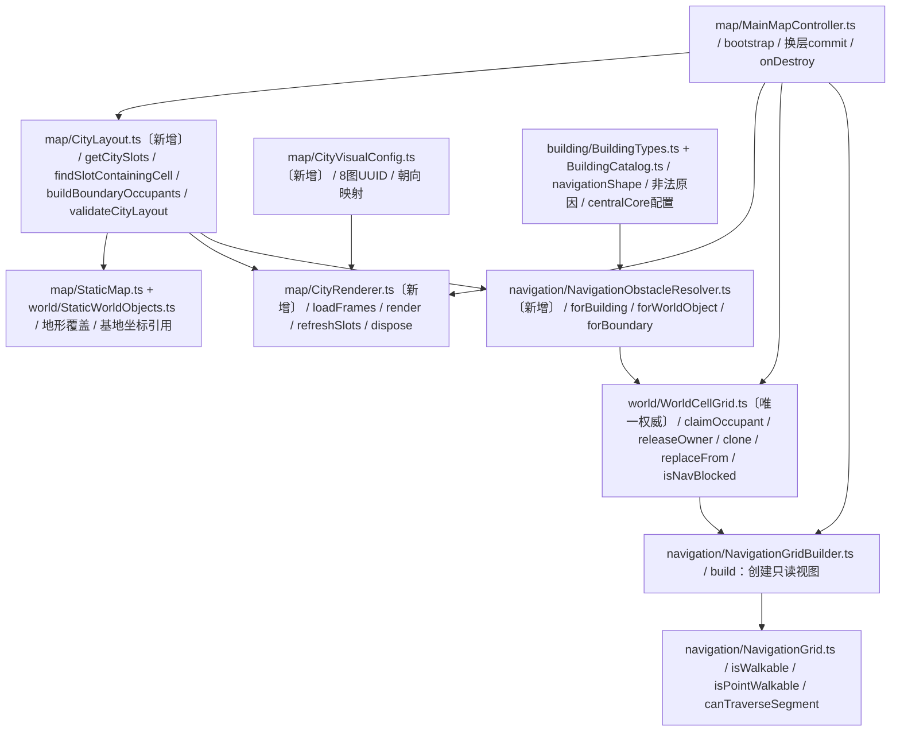
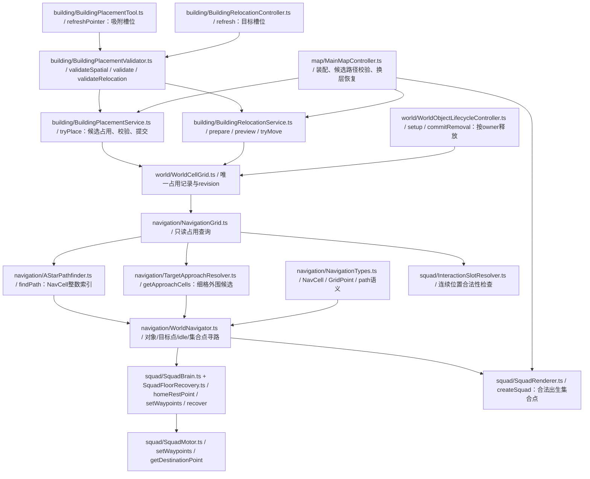

# TowerDown：十二固定建筑位与木城墙技术方案 V1（修订2）

> 待实施方案；本次仅修改此文档。代码基线2f4ad84；图片来自2f4ad84、225c9a2、db06f65。
> 修订：建筑中央不可走、相邻建筑之间有路、空地可走；建筑、基地、资源、城墙、城门接入唯一占用记录。取消上一版“普通建筑blocksNavigation=false”和额外手写墙导航表的做法。
> 保留从下方蓝图进入建造；不加入塔位、点击加号建设菜单、城墙生命或经济结算改造。

## 0. 所有修改文件与方法逻辑关系

图中省略共同前缀assets/scripts/，每个文件的完整职责和方法改动见第3章。分为两个图以便阅读；两图中的WorldCellGrid、NavigationGrid是同一个实例链路，不是两套系统。

### 0.1 城市表现、布局与唯一占用数据流



### 0.2 建造、搬迁、资源移除与路径消费



资源导入变更也属于文件清单：8个图片对应的.png.meta仅将minfilter/magfilter改nearest，不换UUID、不改PNG；名单见1.2。4个新增.ts附带Creator生成的.meta。本轮不修改BuildingRuntimeRegistry.ts，仅复用subscribe/notifyRelocated；不修改下方蓝图UI和世界悬崖逻辑。

## 1. 现状核验与修订原因

- 当前WorldCellGrid拥有flags与owner→格子的Map；NavigationGrid另有可写Uint8Array。建造、搬迁、资源移除和换层在不同地方直接setBlocked/setWalkable，存在双写风险。
- 原NavigationGrid一格等于32px，不能表达2×2建筑中央阻挡、四边各保留半格的通路。
- AStarPathfinder接收整数格；WorldNavigator返回GridCell[]；SquadMotor.setPath对每个点加0.5。细化导航必须修改坐标转换边界，不能只把地图宽高乘2。
- 基地锚点(18,10)，4×4；地图40×23；四种普通建筑均2×2。摆放与搬迁当前仍按任意泥地锚点处理。
- 城市与新图片信息继续沿用核验结果；不凭文件名把门边件当成完整城门。

### 1.2 实图核验与导入ID

以下都是独立PNG，不是新atlas；使用导入的SpriteFrame，不再猜column/row。所有图都有铺满画布的棕色背景，不能假定透明。

| 文件（assets/art/buildings/） | 尺寸 | SpriteFrame UUID | 实图用途判断 |
|---|---|---|---|
| empty land.png | 64×64 | c6dbcda9-95cc-47c6-9186-9ee0b0c38369@f9941 | 土地中央带白色加号；整个槽位提示 |
| woodwall1.png | 32×32 | 6b12cb8a-61dc-47cc-b7e5-fe3fa662e31a@f9941 | 横向连续墙段 |
| woodwall2png.png | 32×32 | 243e3b12-a088-4cae-b457-656068ebf2b2@f9941 | 连向上方与右方的转角 |
| woodwall3.png | 32×32 | 968bdc66-9e3a-449a-9bcc-1edd1c8ad3ba@f9941 | 纵向连续墙段 |
| woodwall4.png | 32×32 | f296672d-0a2b-44c4-b516-976e3b20ce38@f9941 | 连向下方与右方的转角 |
| woodwalldoor1.png | 32×32 | 48ca0e37-5ea5-4b17-85f3-2c284dc0649e@f9941 | 纵墙上侧终止段，向下留缺口 |
| woodwalldoor2.png | 32×32 | b9f0fc4d-5758-4958-ab00-617b6bd736b1@f9941 | 纵墙下侧起始段，向上留缺口 |
| woodwalldoor3.png | 32×32 | d2e6918d-bb36-4e2c-81ce-68d7906889b4@f9941 | 横墙左侧终止段，向右留缺口 |

保留woodwall2png.png的现有拼写及空格文件名，不重命名资源、不重生成UUID。新增图片的texture subMeta目前使用linear，实施时这8个.meta的minfilter、magfilter改nearest，mipfilter保持none；通过Creator导入设置修改并保留其他字段。

这些是本方案对图片的拼接解释，不是作者提供的方向标记。没有独立背面墙图：南北暂复用横墙，东西以水平镜像复用，不做90度旋转或上下翻转。先按下表拼预览检查接缝；若背面透视不能接受，后续补图，不擅自声称已有完整四向美术。

## 2. 单一布局坐标

地图坐标x向右、y向下，均为0起点。保持基地(18,10)不变，因此城市左上角为(15,7)，范围x=15..24、y=7..16（10×10）。内部为x=16..23、y=8..15。中央基地x=18..21、y=10..13。

槽位每2格一个锚点，排除中间四块：

| 行 | 槽位ID与左上角 |
|---|---|
| y=8 | S01(16,8)、S02(18,8)、S03(20,8)、S04(22,8) |
| y=10 | S05(16,10)、S06(22,10) |
| y=12 | S07(16,12)、S08(22,12) |
| y=14 | S09(16,14)、S10(18,14)、S11(20,14)、S12(22,14) |

边框共36格；四门各2格共8格允许导航，剩28格墙体阻挡：

| 方向 | 门格 | 外侧参考点 |
|---|---|---|
| 北 | (19,7)、(20,7) | (19,6)、(20,6) |
| 南 | (19,16)、(20,16) | (19,17)、(20,17) |
| 西 | (15,11)、(15,12) | (14,11)、(14,12) |
| 东 | (24,11)、(24,12) | (25,11)、(25,12) |

坐标参考只用于计算入口，不代表这次实现宝箱交付。


### 2.1 建造格和导航格分别定义，但共享一份占用事实

- 建造格：32×32px，继续使用原GridCell整数坐标，建筑2×2与基地4×4不变。
- 导航细格：16×16px，NAV_SUBDIVISIONS=2；地图80×46个NavCell。
- 地图连续位置GridPoint：仍以32px逻辑格为单位。美术、战斗距离、移速和队伍阵型不乘2。
- 普通2×2建筑对应4×4细格，中央2×2细格阻挡，即中央32×32px；四周各16px可走。
- 两个相邻建筑各留16px，共形成32px通道；没有建筑的空槽全部可走。
- 基地先维持完整4×4阻挡；紧邻基地的普通建筑半格边缘仍提供16px通路。
- 实墙占1×1建造格，该格四个细格全部阻挡；门占建造保留格，但本版常开、导航阻挡集合为空。
- 所有36个边框格都禁止建造；不把“门可走”误写为“门没有占用记录”。
- 空槽不登记阻挡owner、不claim Reserved；槽位是合法性范围，不是障碍。

普通建筑核心示例，锚点为(x,y)：
```ts
// nav coordinates，四个16px细格构成中央32px方块
const navBlockedCells = [
    { nx: x * 2 + 1, ny: y * 2 + 1 },
    { nx: x * 2 + 2, ny: y * 2 + 1 },
    { nx: x * 2 + 1, ny: y * 2 + 2 },
    { nx: x * 2 + 2, ny: y * 2 + 2 },
];
```

这个核心是可配置的原型碰撞形状，不从PNG alpha自动推断。部分屋顶/道具可能覆盖逻辑通路，后续美术应给边缘留白。

### 2.2 唯一性约束

运行时只有WorldCellGrid中的owner记录可以决定静态占用。每条记录同时含：
```ts
interface WorldOccupant {
    ownerId: string;
    flag: WorldCellFlag;
    placementCells: readonly GridCell[];   // 完整建造占地
    navBlockedCells: readonly NavCell[];   // 该owner的实际导航障碍
}
interface NavCell { nx: number; ny: number; }
```

NavigationGrid只持有同一个WorldCellGrid引用；不拥有第二份可独立写入的cells，也不公开setBlocked/setWalkable/replaceFrom。owner表派生的索引可以缓存，但只能由WorldCellGrid事务更新，不允许墙体、建筑或资源管理器私自维护阻挡表。

候选clone用于未提交的事务验证，并非第二份活状态；成功只调用活WorldCellGrid.replaceFrom(candidate)，已有NavigationGrid引用立即看到同一份新事实。失败丢弃候选，不改变活状态。

## 3. 方法级修改方案

### 3.1 新增map/CityLayout.ts

保留布局常量、getCitySlots、findSlotContainingCell、findSlotByAnchor、getCityBoundaryCells、validateCityLayout、assertBuildingsInCitySlots。
- findSlotContainingCell接受鼠标所在建造格，返回整个2×2槽锚点；基地、墙门和城外返回null。
- findSlotByAnchor只接受精确合法锚点，用于最终service防绕过校验。
- buildBoundaryOccupants调用ObstacleResolver生成28个实墙owner和4个门owner；门各占2个建造格，navBlockedCells为空。ID例如city:wall:15:7和city:gate:north。
- 删除上一版applyCityNavigation设计，不允许从布局直接写导航。
- 不把空槽作为Reserved记录。基地仍由base_main owner登记，不重复注册。
- 布局纯函数不加载图、不写资源、不调用经济结算。

### 3.2 CityVisualConfig.ts：新增映射

内部key按用途命名，文件名仅保存在UUID配置中。映射如下：

| 位置 | 图片 | 水平镜像 |
|---|---|---|
| 北/南直墙 | woodwall1 | 否 |
| 西直墙 | woodwall3 | 否 |
| 东直墙 | woodwall3 | 是 |
| 西北角(15,7) | woodwall4 | 否 |
| 东北角(24,7) | woodwall4 | 是 |
| 西南角(15,16) | woodwall2png | 否 |
| 东南角(24,16) | woodwall2png | 是 |
| 北/南门左格 | woodwalldoor3 | 否 |
| 北/南门右格 | woodwalldoor3 | 是 |
| 西门上格/下格 | woodwalldoor1 / woodwalldoor2 | 否 |
| 东门上格/下格 | woodwalldoor1 / woodwalldoor2 | 是 |

每格Sprite仍32×32，不将单张门边图拉伸成64×32。两张终止段组成一处通道，没有开关动画。图内实际缺口窄于两格的逻辑可走范围，属于当前素材与粗粒度导航的近似；验收应观察视觉擦边，不能将整张棕色底图当成物理实心墙。

### 3.3 CityRenderer.ts：新增方法

- static async loadFrames()：用assetManager.loadAny<SpriteFrame>按@f9941加载8张图；任一必要资源缺失即抛出明确文件名/UUID，不能静默沿用其他建筑贴图。
- render()：先清理自身节点，创建12个64×64空槽和36个32×32边框节点。所有格位由CityLayout提供。
- createSprite(parent,frame,rect,flipX)：使用gridRectToWorldCenter和GRID_RENDER_SIZE；Sprite.SizeMode.CUSTOM；复制父layer，UITransform大小与实际占地一致。
- bindRegistry(registry)：保存unsubscribe，订阅建筑add/remove/notifyRelocated，调用refreshSlots()。
- refreshSlots()：从registry的实例锚点推导occupiedSlots，建筑占用则隐藏整个empty land节点，空槽再显示。不另存可写slotOccupied表。
- dispose()：取消订阅并销毁自身节点；不得销毁assetManager共享SpriteFrame。

空地图上的加号已经烘在empty land.png里，因此隐藏整个64×64图，不只在上面盖半透明建筑；不再绘制第二个加号。

节点放在MapRoot/WorldObjectRoot下专用CityRoot（包含SlotRoot、WallRoot），排在StructureRoot、ResourceRoot、BuildingRoot、各Ghost之前；ActorRoot现有层次不改。本轮不加墙体hover点击，不注册HoverInfoTarget、FeedbackClickTarget或Button，不拦截蓝图与单位指令。

加载是异步的，要防止组件销毁后继续render；MainMapController在await返回后检查isValid，失败则停止bootstrap，不建立一半可操作的城市。


### 3.4 StaticMap.ts与StaticWorldObjects.ts

保留40×23，将城市10×10范围覆盖Dirt，保留其余地形。base_main引用同一CITY_LAYOUT.base坐标(18,10)，不重复写魔法数字。外部资源不改，使用完整占地断言没有侵入城市。
forest/quarry继续引用STATIC_MAP，StaticFloorCatalog无需修改。MapRenderer与TerrainAtlas的悬崖不改。

### 3.5 新增navigation/NavigationObstacleResolver.ts

集中处理“规则定义→owner数据”，不存运行时状态：
- forBuilding(instance,definition)：完整4格placementCells；按navigationShape生成centralCore阻挡。blocksNavigation=false仅适用于明确无障碍的未来定义，本次四栋保持true。
- forWorldObject(data)：基地、资源按getWorldVisualDefinition的完整footprint生成placement与全部细格阻挡，保持原外部资源碰撞语义。
- forBoundary(cellOrGate)：墙全阻挡；门保留占地、导航为空。
- validateMask(record)：所有NavCell整数、界内，并落在该owner的placementCells范围内；本轮不做伸出占地的障碍。
- buildRectNavMask与buildCentralCoreMask：纯函数复用，无asset/Node依赖。

### 3.6 world/WorldCellGrid.ts：唯一权威记录

保留建造查询isInside/getFlags/isBlocked/getOwnerCells，保持建造格语义。
新增或替换：
- claimOccupant(record)：先完整验证重复owner、重复格、越界、占地重叠及mask合法性，再一次安装记录、刷新索引、revision+1。异常不能留下部分flags。
- releaseOwner(ownerId)：只释放该owner的placement与navBlockedCells，空门释放不会改动旁边墙；不存在owner为幂等无操作。
- getOwnerRecord(ownerId)：供回滚/搬迁使用，不能只备份placementCells而遗漏mask。
- isNavBlocked(nx,ny)：读唯一记录派生索引；界外视为阻挡，接口验证整数。
- clone()：深拷贝owner及索引，不共享可写数组，保留候选originRevision。
- replaceFrom(candidate)：验证尺寸、候选完整性与活revision符合预期，再原子替换owner和索引；保持WorldCellGrid对象身份。
- assertConsistent()：开发期检查owner与派生索引一致。

删除旧claim/claimRect的无mask写入方式，调用点全部迁移到claimOccupant(resolver结果)，避免留下“登记建造但忘记登记导航”的入口。flags只是建造查询缓存，不能让Reserved自动等同于导航阻挡。

### 3.7 navigation/NavigationGrid.ts、NavigationGridBuilder.ts

NavigationGrid：
- constructor(occupancy:WorldCellGrid)，width=occupancy.width*2，height=occupancy.height*2，另暴露mapWidth/mapHeight用于原地图坐标。
- isWalkable(nx,ny)：细格整数查询，委托occupancy.isNavBlocked。
- isPointWalkable(point:GridPoint)：转换至NavCell后查询，供出生/交互位等外层调用。
- worldToNavCell(point)：floor(point.x*2)、floor(point.y*2)，不能round。
- navCellToWorldPoint(cell)：((nx+0.5)/2,(ny+0.5)/2)。
- canTraverseSegment(a,b)：对连续移动线段做supercover/DDA细格遍历，检查拐角两侧，避免只看终点就穿过核心。
- countBlocked()：遍历细格统计，仅调试。
- 删除公开setBlocked、setWalkable、replaceFrom和独立cells数组。

NavigationGridBuilder.build(occupancy)仅创建只读NavigationGrid。移除旧build(map,objects)中按图片footprint重复生成障碍的代码；权威占用在MainMapController中先构造。

### 3.8 NavigationTypes.ts、AStarPathfinder.ts、TargetApproachResolver.ts

NavigationTypes：
- 保留GridCell用于32px建造格，GridPoint用于原地图连续单位。
- 新增NavCell{nx,ny}避免两种整数坐标误传。
- NavigationPathResult改为{approachPoint:GridPoint,path:GridPoint[]}。暴露给移动系统的路径永远已转换，不把NavCell交给Motor。
- 不再用approachCell命名一个连续点。

AStarPathfinder.findPath：
- start/goal/path用NavCell；索引为ny*grid.width+nx，邻域步进为1个细格，10/14成本和禁止斜切障碍角保留。
- toIndex/fromIndex、heuristic、getPathCost、reconstructPath相应改nx/ny；不改渲染和移速。
- 输出不含start的约定维持，由WorldNavigator处理真实起点与首个细格中心的接线。

TargetApproachResolver.getApproachCells：
- 根据对象逻辑rect×2，在完整阻挡范围外枚举细格外围，输出NavCell[]；过滤不可走，去重。
- 仍只处理已有world target，不为墙新加可攻击目标。

### 3.9 WorldNavigator.ts

- findPathToObject(start,target)：start为GridPoint，求NavCell起点/外围候选，经A*选路径，最终转换为GridPoint[]及approachPoint。
- findPathToPoint(start,target:GridPoint)：替换内部findPathToCell调用，目标保留小数，不能floor回32px粗格。
- findRandomPathToTerrain：枚举可走细格，terrain下标floor(nx/2)、floor(ny/2)；最小距离仍用原GridPoint单位。正常A*，不是随机传送。
- findNearestWalkablePointInRow：替代旧粗格方法，返回细格中心的GridPoint，半格走廊可被找到。
- resolveStartCell：用worldToNavCell；如果起点非法，返回失败并交调用者处理，不用“找附近可走格”然后直线穿墙接过去。
- 路径首段从真实start到首个中心用canTraverseSegment校验；必要时先接同一可走细格中心。路径简化如保留，必须逐段同样验证；本轮可不简化。
- calculatePathCost在NavCell层比较，或按GridPoint距离比较，统一不能混用两种尺度。

参考转换：
```ts
const navPath = pathfinder.findPath(grid, grid.worldToNavCell(start), goal);
if (navPath === null) return null;
const points = navPath.map(cell => grid.navCellToWorldPoint(cell));
// 校验真实起点到首点；空路径保持既有“已到达”语义。
return points;
```

### 3.10 BuildingTypes.ts、BuildingCatalog.ts、BuildingPlacementValidator.ts

BuildingDefinition新增navigationShape:'full'|'centralCore'（可选、默认full）；本次四种2×2建筑均blocksNavigation:true、navigationShape:'centralCore'，不再采用false。
PlacementInvalidReason追加OutsideCitySlot、UnsupportedCityFootprint、NavigationConflict；不重排原值。查询所有reason文案映射并补提示。

Validator新增validateSpatial(definition,x,y,ignoredOwnerId?)供validate/validateRelocation共用：
- 整数坐标、界内、2×2定义、精确槽锚点、allowedTerrain；
- 对完整4个建造格检查其他owner，边缘可走不意味着可重叠造房；
- relocation仅忽略自身owner。
validate继续费用和队伍gate；relocation不扣费。
动态单位覆盖/路线有效性由service候选校验负责，不在纯validator复制导航状态。

### 3.11 BuildingPlacementTool.ts、BuildingRelocationController.ts

PlacementTool.refreshPointer：projectScreenPoint得到建造格，再findSlotContainingCell；pointerCell保存槽锚点。空槽可预览，占用/缺钱显示红色，无槽清空pointerCell/currentSnapshot并hideGhost，确认重新validate。
RelocationController.refresh：指针槽作为目标，不再cell-grabOffset；移除闲置grabOffset；保留拖动阈值、最终重采样、Esc/失焦取消及UI互斥。自身槽no-op，他人槽不交换。

继续使用下方BuildCardStripController和原建造模式，空地加号不注册交互。

### 3.12 BuildingPlacementService.ts、BuildingRelocationService.ts：统一事务

二者注入同一个validateCandidateNavigation(candidateView)回调，MainMapController组织现有单位与目的地检查。

BuildingPlacementService.tryPlace：
1. 精确槽校验与费用检查，创建候选owner记录。
2. clone唯一占用表，在候选claim新建筑；构造候选NavigationGrid只读视图。
3. 检查存活单位foot point与新核心不重叠，已有活动路径是否可重算；失败返回NavigationConflict，不扣费、不刷兵。
4. 同步提交段内保存必要快照、扣费、replaceFrom(candidate)、创建节点、注册与兵营回调；成功应用重算路径。
5. 异常回滚经济、owner记录、节点与队伍权益；不再逐格setWalkable回滚。延续既有onPlacementRolledBack，不绕过免费首营和队伍上限。
6. 注册与通知必须见到完整一致状态；关键提交不得跨await，revision不匹配重算。

BuildingRelocationService.prepare：
- clone占用表、release旧owner、claim同ID新位置record，再查candidate导航和单位/路径。
- preview只读候选，tryMove在最终指针处重算；成功移动node、替换owner、更新data锚点，再notifyRelocated与应用路径。
- 回滚必须保留完整旧record，包括nav mask；不复制/提交第二个导航数组。
- no-op不改revision、不触发成长。满城交换仍不在本轮。

建造也必须加入候选路径验证，不能只在搬迁时保护单位。动态单位不存入静态owner表，使用同一候选只读视图检查即可。

### 3.13 WorldObjectLifecycleController.ts

setup必须拿到WorldCellGrid，不再可选。commitRemoval到原0.12s移除时点后：移除资源显示，releaseOwner(removal.objectId)，不循环navigationGrid.setWalkable。
移除未使用的navigationGrid字段/参数、getWorldVisualDefinition依赖，并调整MainMapController调用。
资源耗尽只释放自己的核心范围，墙/门owner不受影响；clearPendingForFloorChange在换入新占用前执行，防止旧层延迟回调误删。

### 3.14 SquadMotor.ts、SquadBrain.ts、SquadFloorRecovery.ts

- SquadMotor直接使用已有setWaypoints(GridPoint[])。删除旧setPath(GridCell[])或全部迁移后明确停用，禁止再+0.5。
- getDestinationCell替换为getDestinationPoint，返回真实小数终点，搬迁/建造重算路径不能丢失半格精度。
- 移速、gridPointToWorld与阵型尺度维持原单位。
- SquadBrain所有pathResult.path及idle path改调用setWaypoints；homeRestCell改homeRestPoint:GridPoint，setup/resetForFloor、issueReturnHome/startReturnHomeFromCurrentPosition等走findPathToPoint。
- SquadFloorRecovery.recover的homeCells改homePoints，传递连续点，motor.teleportForFloor仍使用GridPoint。恢复点先验证后提交，不能用floor产生新阻挡点。

### 3.15 SquadRenderer.ts、InteractionSlotResolver.ts

SquadRenderer.createSquad：
- 原preferredSpawn仅作为搜索参考；利用导航只读视图找合法集合点，检查所有formationOffset对应foot point。
- 出生point与homeRestPoint来自同一结果，不只修home却保留非法spawn。
- 城内找不到容纳当前编制的位置时，搜索可达城门外空地，不能将16人强塞半格走廊。新增resolveSpawnPoint方法负责搜索，算法可供MainMapController整备复用为静态纯帮助函数或导出函数，仍放此文件。
- addMembers后整备使用最终人数，生成完整formationOffsets再选点。

InteractionSlotResolver：现有floor(worldPoint)再isWalkable的粗格检查改isPointWalkable(worldPoint)，边界检查保持原地图宽高，不用80×46误当逻辑地图。交互位选择若需从当前位置移动，使用同一视图验证线段，不能仅因目标合法就穿核心过去。

### 3.16 MainMapController.ts：唯一装配和换层入口

bootstrap：
1. validateCityLayout，世界对象经forWorldObject、城墙城门经buildBoundaryOccupants逐个claimOccupant。
2. 用NavigationGridBuilder.build(worldCellGrid)创建活导航只读视图，所有Navigator/Renderer/服务共享此视图或同一owner引用。
3. 创建CityRoot/加载图/render；buildingRegistry创建后bindRegistry，销毁时dispose。保持下方蓝图与输入互斥。
4. 抽出validateCandidateNavigation方法或局部具名函数，取代现有只供relocation的newlyBlocked逻辑。使用isPointWalkable连续坐标，单位中心及存活成员都检查；目的地使用getDestinationPoint与findPathToPoint。
5. 遇到新的障碍挡住单位当前位置则拒绝建造/搬迁；旧路径受影响时重算，无法达目的地则拒绝。本轮不做强制推开单位。

换层commit回调：
1. 根据nextObjects、buildBoundaryOccupants和全部现有building实例，构造一个candidate WorldCellGrid；检查槽位和重复owner，derive只读candidate NavigationGrid。
2. 按结算后编制验证出生/恢复点、资源无重叠，完成后才提交。允许候选失败时保留当前城市，不先覆盖活占用。
3. 清理旧层pending removal，调用worldCellGrid.replaceFrom(candidate)；不要navigationGrid.replaceFrom。
4. 沿用结算幂等与资源/怪物替换流程，恢复队伍，保留CityRoot与建筑节点。refreshSlots只更新加号，不重复生成边框。
5. 所有首层/换层/建造/重摆/资源移除都只通过owner记录改变障碍，不再单独补墙导航。

### 3.17 单兵阵型限制与验收口径

细格通路解决静态拓扑与小队中心寻路，不等于已经实现单兵独立寻路。当前WarriorMotor相对队伍中心直线运动、展开战斗会有擦墙风险；本轮不改其状态机，不承诺全部成员无穿透。

不允许以此限制为由取消建筑核心或放开墙：核心和墙必须在唯一占用表中真实阻挡，所有正式寻路都必须绕行。下一步若要保证每个成员通过16px边缘，需针对过门收队、局部避障与归队路径另写方案。本次明确验收静态导航、单位生成和候选建造不压人；不把中心能通过当作单兵方案已完成。

## 4. 实施顺序与回归

1. WorldOccupant契约、16px坐标转换、ObstacleResolver与WorldCellGrid唯一占用；先做纯逻辑验证。
2. NavigationGrid只读化，A*与WorldNavigator路径坐标适配，迁移所有消费者，禁止遗留双写。
3. CityLayout和图片渲染；保留原坐标与素材。
4. 新建/搬迁槽吸附和候选事务；资源释放、首层、换层统一注册。
5. 出生/整备点和idle通路回归。
6. Creator完整运行验证，不顺便做城墙战斗、塔位或结算UI。

用rg检查setBlocked/setWalkable/navigationGrid.replaceFrom及旧setPath/getDestinationCell/approachCell：运行时代码不能存在旧语义调用。相关纯测试应迁移类型，不能靠any绕过NavCell与GridPoint差异。

## 5. 验收清单

### 5.1 逻辑与唯一性
- 12槽48建造格+基地16格覆盖内部；28实墙格、8门格；所有owner唯一。
- 空2×2槽16个导航细格全可走；建筑落成后仅中央4细格阻挡，边缘12格可走。
- 相邻满建槽位之间形成32px连通通路；核心不能穿，中央基地保持阻挡，四门与城外连通。
- 门有占用owner、不能造建筑、导航可过；墙owner同时阻建和阻行。
- 建筑/资源释放只删除自身mask；预览或失败候选不改变活revision，回滚后owner与路径一致。
- 新建、搬迁与换层只有一份活WorldCellGrid；NavigationGrid不含独立可写阻挡数组。
- floor点→细格→中心转换正确；地形下标仍40×23，移动速度和战斗距离不翻倍。
- A*禁止斜切核心/墙角；真实起点接线和路径段不能跨障碍；非法出生不偷偷瞬移出墙。

### 5.2 实机
- 保留12空槽、4门、无塔位、下方蓝图操作；空地加号不可点开新菜单。
- 槽内四格吸附同一锚点；城外与门格不能造；合法一次扣费，占用槽不能叠造。
- 空槽可自由走；建筑中央不能成为合法导航目标，相邻建筑间可以规划和执行小队中心路径。
- 拖动建筑不收费、不换身份、不刷兵；新核心压住单位或使活动目标不可达时拒绝。
- 连续换层保留建筑与全部墙门owner，资源刷新正常、旧资源移除不抹掉新障碍。
- 4/8/16人生成和恢复点合法，无法在城内集合则在可达城门外集合；半格路径无额外+0.5偏移。
- 单兵阵型擦边问题按3.17记录，不伪报为完整单兵避障。
- 图片像素清晰、转角相接、加号不透出已占槽；基地AB动画、摄像机和悬崖无回归。

## 6. 交付边界

本次文档修订覆盖原方案，不新增第二份并行生效的V2文档。后续实施会比上一版涉及更多导航文件，这是为了真正表达半格通道并消除占用双写，而不是仅修改美术。不修改GDD、经济数值或免费首营规则。
